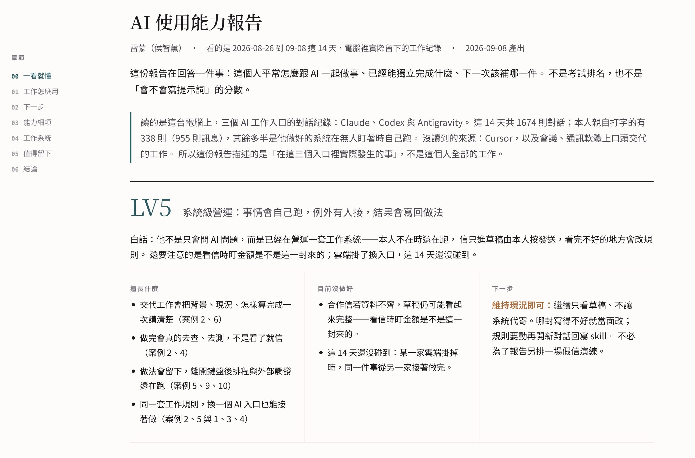
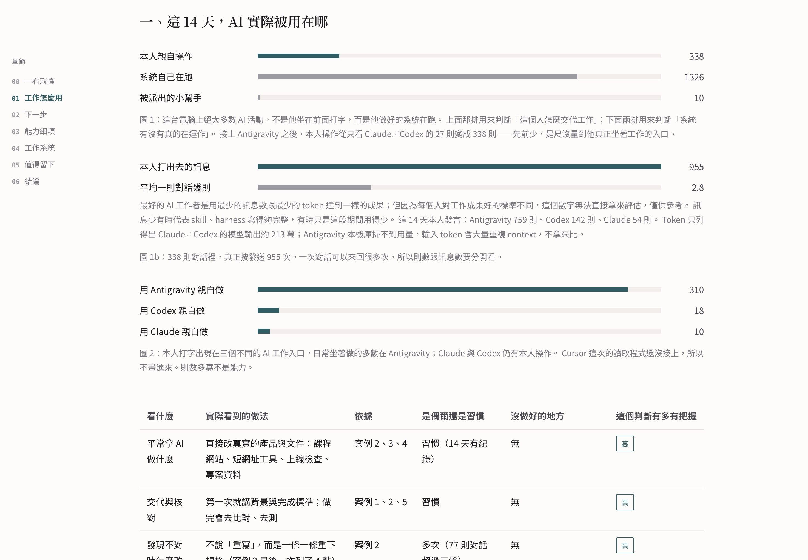
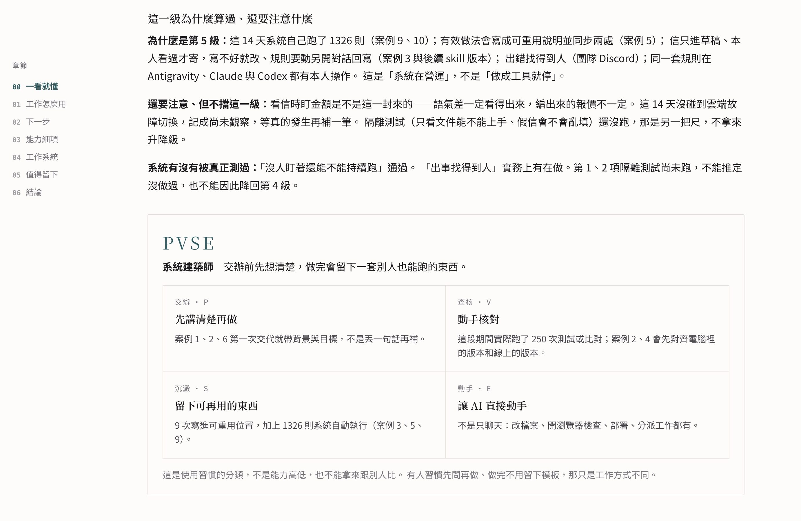
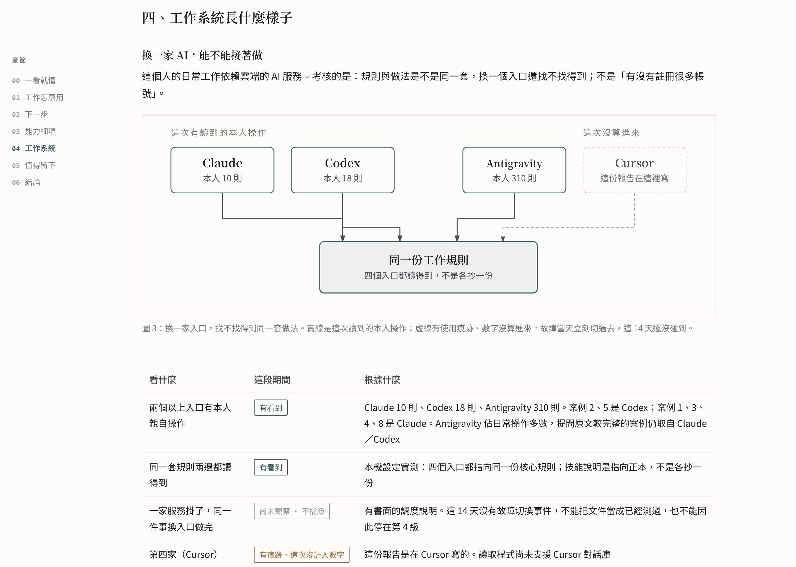
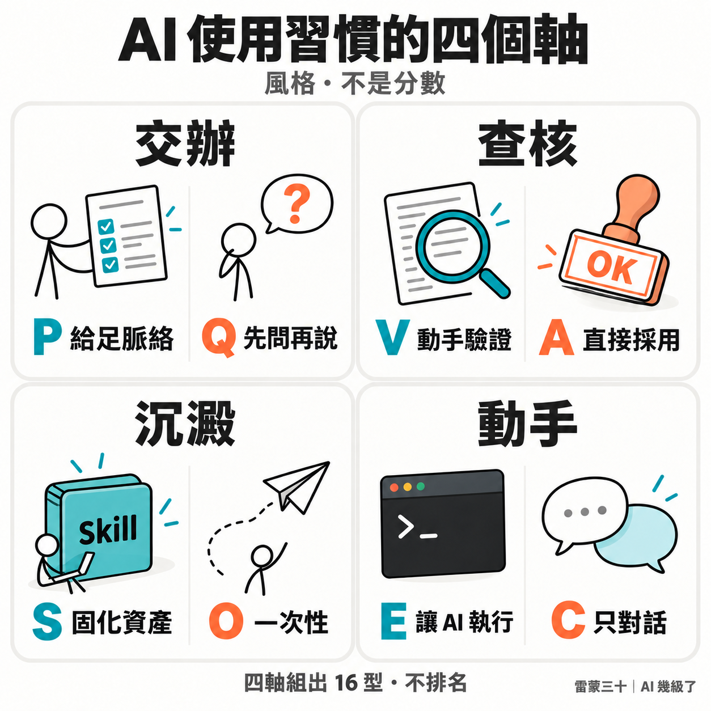

**繁體中文** · [English](README.en.md)

<div align="center">

# AI 幾級了 ai-level-check

### 你敢加入挑戰嗎？讓 AI 來評估你／員工／主管／老闆的 AI 能力

[](LICENSE)
[](CHANGELOG.md)
[](references/log-sources.md)
[](README.md)
[](README.en.md)
[](references/privacy.md)

<br>

讓 AI 來評估你的 AI 能力，不是讓人來評估。<br>
最準的方式，是讓 AI 去讀 AI 的使用紀錄。

<br>

<table>
<tr><td align="left">

🧑‍💼 &nbsp;主管想知道團隊 AI 幾級了，只能問「你最近有在用嗎」，得到「有啊很好用」？<br>
📄 &nbsp;做了一份 AI 能力問卷，大家照著自己想像中的樣子填，填完誰也不知道那是真的還假的？<br>
🎓 &nbsp;上完 AI 課程，學員想知道自己到底進步了沒，只能憑感覺？<br>
💼 &nbsp;面試時，給他裝這個 skill 跑一份報告、螢幕分享給你看。不用等他胡謅「我最近都有在用 AI」。

</td></tr>
</table>

### ✨ 這些，`AI 幾級了.skill` 都能解決。

<br>

掃 Claude Code、Codex、Antigravity 留在硬碟上的紀錄，
看這個人怎麼下指令、呼叫了哪些工具、怎麼修正、做出什麼成果，
產出一份 **有案例、可追溯** 的 AI 使用能力報告。

**LV0–LV5 使用等級 · 組織強度與應用成熟度 · 四項系統驗證 · 16 型人物志 · 單檔 HTML 報告書**

給 Claude Code、Codex、Cursor 和任何能讀 Markdown 的 AI agent 用。

<br>

**先確認讀到什麼 → 再判斷看到什麼 → 最後才說可以怎麼改**

不是讓 AI 給人打分數，是讓 AI 把證據攤開來，讓人自己看見。

</div>

---

## 先看長什麼樣子

下面四張是真的跑出來的報告（2026-08-26 到 09-08，14 天）。想自己捲、切等級，打開公開示範：
[AI 幾級了 Demo](https://ai.lifehacker.tw/reports/ai-level-check-demo/)

<table>
<tr>
<td width="50%"></td>
<td width="50%"></td>
</tr>
<tr>
<td></td>
<td></td>
</tr>
</table>

截圖是雷蒙自己執行的真實截圖片段。[Demo 站](https://ai.lifehacker.tw/reports/ai-level-check-demo/) 是模擬資料。

| 示範 | 等級 | 這個人在做什麼 |
| :-- | :-- | :-- |
| [Demo 1 · LV1](https://ai.lifehacker.tw/reports/ai-level-check-demo/lv1.html) | 換句話重問 | 只用網頁版聊天，覺得不對就再問一次 |
| [Demo 2 · LV3](https://ai.lifehacker.tw/reports/ai-level-check-demo/lv3.html) | 精準下指令 | 交代清楚、會指出錯、會驗證，還沒留下模板 |
| [Demo 3 · LV4](https://ai.lifehacker.tw/reports/ai-level-check-demo/lv4.html) | 模組化使用 | 做法寫成 skill，有一點排程，系統還沒自己跑 |

---

## 如何使用「AI 幾級了」？

兩種人，兩條路。處理都發生在**你自己的電腦**，或你本來就在用的那個網頁 Chat；**不會送到這個專案，也不會送到雷蒙這邊**。

### 1. 已經有 AI Agent

Claude Code、Codex、Cursor、Antigravity：把 skill 裝進去，對它說「幫我跑這兩週的 AI 使用檢核」。它在你這台電腦掃紀錄、寫報告。

```bash
git clone https://github.com/Raymondhou0917/ai-level-check.git ~/ai-level-check
ln -s ~/ai-level-check ~/.claude/skills/ai-level-check
```

其他入口見 [Claude Code](install/claude-code.md)、[Codex](install/codex.md)、[Cursor](install/cursor.md)。

只想先看數字、不要完整報告：

```bash
python3 ~/ai-level-check/scripts/collect.py --days 14
```

純標準庫，不用裝套件，不連網、不上傳。

### 2. 只用網頁版 ChatGPT 或 Gemini

打開 [prompts/chat-paste.md](prompts/chat-paste.md)，複製 Prompt 貼進網頁對話。Prompt 裡有公開 repo 網址，讓它自己去讀判準。

- 這串已經聊過工作：直接說「用這一串評估我，開始寫報告」
- 新開的空白對話：把最近對話貼在後面再叫它寫
- **不要叫它「照 Demo 再做一份」。** Demo 是虛構的林可安／周子寧／何柏廷。版型用 `templates/report-skeleton.html`。自己的報告總覽一定要有 16 型人物志（四字母＋四軸格）；沒有就說「補人物志，不要打開 Demo」

多數網頁版（含 Gemini）看不到別串記憶。不要只說「用你以前對我的記憶」。這條路通常最多到 LV3。不是比較弱，是網頁版看不到硬碟上的系統。

---

## 面試現場：讓紀錄自己說話

以前面試，都是直接問「你 AI 應用能力怎麼樣」。
對方講得再完整，你也分不出那是真的用過，還是面試前兩天惡補的。

現在可以改成三步：

1. 請面試者在**他自己的電腦**安裝這個 skill
2. 讓他跑一份最近兩週的報告
3. 他螢幕分享給你看，或當下用他的電腦打開報告

你看到的是他怎麼下指令、有沒有驗證、做完有沒有留下東西——不是他臨場編的故事。
這樣會快很多，也不用等他胡謅。

用這個場景時請守三件事：

- **本人自己跑。** 面試官不代跑，也不要求他把 `~/.claude/` 打包寄來。
- **用螢幕分享就好，不要把 HTML 寄出來、不要截圖存檔。** 報告裡可能有現職的客戶名、還沒公開的產品。
- **這份報告不能單獨當作錄用或淘汰依據。** 只用 ChatGPT 網頁版的人，本機常常掃不到紀錄，那不是能力差，是來源不同。

隱私與同意的完整界線見 [references/privacy.md](references/privacy.md)。

---

## 為什麼要讓 AI 來評

人評估人有三個躲不掉的問題：**看不到、記不住、有情緒。**

主管看不到你半夜怎麼跟 AI 來回八次把一個 bug 修好，
只看得到週會上那三分鐘的口頭報告。
他記不住你三個月前的樣子，只記得上禮拜那次做得不錯。
而且他今天心情好不好，會影響他怎麼讀你交出來的東西。
面試也一樣：別聽信「我最近都有在用 AI」，他的紀錄自己會說話。

AI 沒有這三個問題。它讀得到每一則對話、記得住整個期間、對你沒有意見。

但更重要的是第四件事：**AI 能力這件事，人本來就評不準。**

一個人的 AI 能力不在他會不會講「prompt engineering」，
而在他交辦時給不給完成標準、AI 答錯時他指不指得出具體哪裡錯、
做完之後有沒有留下下次能用的東西。這些全部藏在對話紀錄裡，
只有讀得完那些紀錄的東西，才評得出來。

> **讓 AI 來評估你的 AI 能力，不是讓人來評估。**<br>
> **最準的方式，是讓 AI 去讀 AI 的使用紀錄。**

---

## 它會讀什麼、產出什麼

本機 skill 掃的是你電腦裡已經有的 agent 紀錄，產出一份單檔 HTML 報告。腳本不連網；原始對話不上傳到這個專案，雷蒙也看不到。

你如果本來就用雲端 LLM，對話本來就會經過那家的雲端。這套工具不會多開一條路，把資料送到我這邊。

流程圖、證據包、團隊推送見 [docs/how-it-works.md](docs/how-it-works.md)。隱私紅線見 [references/privacy.md](references/privacy.md)。

---

## 最關鍵的一件事：人打的字，跟機器打的字要分開

這是實作的時候才發現、但會決定整份報告成敗的問題。

`~/.claude/projects/` 底下同時躺著兩種東西：你在鍵盤前打的字，
以及**你寫的 bot 半夜自己跑出來的 system prompt**。兩者格式一模一樣。

不分流會發生什麼？同一台機器、同一批 14 天的紀錄（2026-09 實測）：

| | 不分流 | 分流後只算 `human` |
| :-- | --: | --: |
| 對話數 | 1,255 則 | **42 則**（另有 automation 1,207、subagent 6） |
| 「使用者發言」長度中位數 | 16,536 字 | **120 字** |
| 「交辦時給了條件」訊號 | 1,214 次 | **17 次** |

左邊那欄不是這個人打字的樣子——16,536 字的「發言」是他的 bot 的 system prompt。
拿左邊那欄去分析「這個人怎麼下 prompt」，得到的每一個結論都是錯的。

所以 `collect.py` 會依平台欄位把每則對話分成三類：

| 類型 | 是什麼 | 怎麼用 |
| :-- | :-- | :-- |
| `human` | 本人在鍵盤前打的 | **提問行為只算這一類** |
| `automation` | 本人寫的程式或排程驅動的 | 不算提問行為，改列為 LV4–LV5 的實作證據 |
| `subagent` | 被主對話派出去的子代理 | 分工的線索 |

而且自動化紀錄不是雜訊——它回答一個更難得的問題：
**這個人做出來的東西，在他不在場的時候還跑不跑？**

判準與各家欄位的實測分布見 [references/log-sources.md](references/log-sources.md)。

---

## 使用等級 LV0–LV5

| 等級 | 名稱 | 一句話 |
| :-- | :-- | :-- |
| **LV0** | 問答靠人品 | 該補條件、該查核的任務，沒處理就採用答案 |
| **LV1** | 換句話重問 | 察覺得到錯誤，靠換說法和多問幾次推進 |
| **LV2** | 單點式應用 | 能穩定完成單一類任務，判斷得出答案能不能用 |
| **LV3** | 精準下指令 | 給得出背景、範圍與完成標準；答錯時指得出具體問題 |
| **LV4** | 模組化使用 | 把有效做法固定成模板、Skill 或代理，啟用前會實際測試 |
| **LV5** | 系統級營運 | 分工、例外處理、維護與回寫整合成系統；依賴雲端 LLM 時還要兩個入口讀同一套規則 |

三條硬規則：

- **LV0 不是資料不足時的預設值。** 掃不到紀錄就寫「無法定級」。
- **LV4–LV5 需要實作證據。** 光有構想、自述或 AI 宣稱完成，都不算。
- **未觀察到不等於不會。** 沒讀到某個等級的紀錄，只能說沒讀到。

完整判準與「證據包欄位 → 能支持什麼」對照表見 [references/levels.md](references/levels.md)。

### 自動化齒輪：離開鍵盤之後，還有沒有事情在發生

「有沒有做自動化」問得太籠統，答案永遠是「有啊我有用」。
所以拆成五顆具體的齒輪——現代系統要讓一件事自己發生，底層就只有這五種扳機：

```
你要讓什麼事自己發生？
│
├─►「每天特定時間、每隔幾小時做一次」        └── ① 時間排程　Cron / launchd
├─►「外部一有動靜（填表、刷卡、留言）就處理」 └── ② 網路鉤子　Webhook / n8n
├─►「打開 AI、git commit 的瞬間強制插隊」     └── ③ 生命週期鉤子　SessionStart / pre-commit
├─►「推上 GitHub 就自動測試打包上線」         └── ④ 持續整合部署　Actions / Zeabur
└─►「機器人當掉自動拉起、死了通知我」         └── ⑤ 守護與心跳　pm2 / KeepAlive
```

五顆都在硬碟上留痕跡——寫了什麼檔、跑了什麼指令、用了什麼工具——
所以不用填任何表，掃現有紀錄就查得到。

> **覆蓋度不是分數。** 五顆全用過不比兩顆好；一個內容工作者只需要 ① 和 ②，
> 硬去搞 ④ 只是浪費時間。**未觀察到也不等於不會**——齒輪是期間快照，
> 三個月前設好一直穩定在跑的東西，這期間根本不會被動到。

實作時踩到的坑值得寫出來：第一版偵測直接關鍵字掃指令，結果 5 顆全中，
但證據長這樣——`rg -n -i "…webhook…"`。那是在**搜尋** webhook，不是在**架** webhook。
收緊成「只認做了、不認提到」之後，同一批資料變成 3／5，每顆都指得出真實 artifact。
**會誤報的偵測器比沒有偵測器更危險**，因為它產出的是看起來有根據的假證據。

判準、偵測規則與課程用法見 [references/automation-gears.md](references/automation-gears.md)。

### 另外還有四項系統驗證（跟等級分開算）

等級回答「已展現什麼用法」，系統驗證回答「這套做法哪些部分**真的被測過**」：

1. 只看文件，一個沒有脈絡的新人能不能把工作完成
2. 資料有錯或缺漏時，系統會停下來回報，還是硬做出一份錯的
3. 沒人盯著的時候，自動化能不能持續正確執行
4. 接手的人找不找得到負責人、版本、驗收條件與回報窗口

四項通過不會自動升為 LV5；未驗證也不會自動降級。

---

## 16 型 AI 使用人物志

這部分是給團隊工作坊和課堂用的，也是唯一適合公開分享的一層。



看 [16 型四組圖解](references/personas.md#16-型四組圖解)，再對照下方的四軸與型名。

四個軸，每軸都要從紀錄指得出證據：

```
  交辦   P 給足脈絡 ──────── Q 先問再說
  查核   V 動手驗證 ──────── A 直接採用
  沉澱   S 固化資產 ──────── O 一次性
  動手   E 讓 AI 執行 ────── C 只對話
```

組出 16 型：

| | 給足脈絡 P | | 先問再說 Q | |
| :-- | :-- | :-- | :-- | :-- |
| | **驗證 V** | **採用 A** | **驗證 V** | **採用 A** |
| **固化 S ＋ 執行 E** | 系統建築師 | 自動化狂人 | 邊做邊修的工程腦 | 一把梭 |
| **固化 S ＋ 對話 C** | 流程設計者 | 交辦型主管 | 好奇查證家 | 靈感速記員 |
| **一次性 O ＋ 執行 E** | 精準特工 | 效率外包客 | 直覺實驗家 | 許願池 |
| **一次性 O ＋ 對話 C** | 求證派 | 需求規格官 | 抬槓辯論家 | 閒聊夥伴 |

> **分型是風格，不是分數。** `QAOC`（閒聊夥伴）不比 `PVSE`（系統建築師）差，
> 只是把 AI 用在不同的地方。一個 `QAOC` 可能是 LV3，一個 `PVSE` 也可能只到 LV2。
>
> 這句話在報告裡每次出現分型都要一起寫。分型一旦被讀成分數，
> 整份報告就會被拿去做它不該做的事。

每一型的典型行為、常見盲點與「下一步先做什麼」見
[references/personas.md](references/personas.md)。

---

## 隱私邊界：這個專案刻意做不到的事

這套工具讀的是一個人每天工作時打的字。技術上它做得到監控，
擋住它的只有制度，不是程式。所以以下幾條寫死在規則裡：

| 做不到 | 為什麼 |
| :-- | :-- |
| 排名、百分位、「勝過多少比例的人」 | 不存在可查證的全球 AI 使用者能力資料庫，那些數字只能是編的 |
| 遠端集中掃描員工的紀錄 | `collect.py` 只讀本機。要看團隊狀況，做法是每個人自己跑 |
| 自動推送、自動上傳 | 會越過「本人看過才推」那一關 |
| 用提示詞長度、對話輪數、工具數量當能力指標 | 短提問不是弱點，長提問也不是能力 |
| 接進自動化的人事決定流程 | 這是觀察報告，不是考績工具 |

> **這份報告不能單獨作為考績、升遷、解僱或調職的依據。**

導入前該跟團隊講清楚哪四件事、兩種可行的用法、哪三件事做了會讓所有人開始表演——
見 [references/privacy.md](references/privacy.md) 與 [install/team-deploy.md](install/team-deploy.md)。

---

## 各平台安裝細節

怎麼跑見上面「如何使用」。這裡只放各入口的補充：

| 平台 | 文件 |
| :-- | :-- |
| Claude Code | [install/claude-code.md](install/claude-code.md) |
| Codex | [install/codex.md](install/codex.md) |
| Cursor / 其他 agent | [install/cursor.md](install/cursor.md) |
| 只用網頁版 Chat | [prompts/chat-paste.md](prompts/chat-paste.md) |
| 團隊部署 | [install/team-deploy.md](install/team-deploy.md) |

### 專案結構

```
ai-level-check/
├── SKILL.md                        七步流程：同意閘門 → 證據包 → 定級 → 驗證 → 分型 → 報告 → 存證
├── scripts/
│   ├── collect.py                  掃紀錄產證據包（純標準庫）
│   └── publish.sh                  推報告進 private repo（不 force push、不覆蓋、推前掃金鑰）
├── references/
│   ├── levels.md                   LV0–LV5 判準 ＋ 證據包欄位對照表
│   ├── evidence-rules.md           證據歸屬、公平判斷、組織強度、事業掌握、應用成熟度
│   ├── automation-gears.md         五種自動化齒輪的判準與偵測規則
│   ├── personas.md                 16 型人物志
│   ├── log-sources.md              各家紀錄格式的實測文件
│   ├── report-design.md            兩層報告結構與 HTML 規範
│   └── privacy.md                  三條紅線與導入邊界
├── prompts/chat-paste.md           給 ChatGPT／Gemini／Claude 網頁版複製的檢核 Prompt
├── templates/report-skeleton.html  報告版型骨架（單檔、可列印 A4）
├── docs/                           虛構示範站（LV1／LV3／LV4）＋ [how-it-works.md](docs/how-it-works.md)
├── evals/report-checklist.md       報告有沒有守規矩的檢查
└── install/                        Claude Code · Codex · Cursor · 團隊部署
```

---

## 常見問題

### 我沒有 Claude Code 或 Codex，只用 ChatGPT 網頁版

打開 [prompts/chat-paste.md](prompts/chat-paste.md)，複製 Prompt。已在這串聊過就直接叫它寫；新開空白對話再貼紀錄。

這條路評的是你貼進去的問答，看不到排程、草稿信箱、本機腳本。
報告開頭會寫分析範圍；等級通常最多穩到 LV3。要看 LV4／LV5，還是得在自己電腦跑 skill。

不要把整份 `SKILL.md` 貼給網頁版——那是給會掃硬碟的 agent 用的。

### 掃出來說我是 LV2，可是我覺得我明明有做更多

很可能是對的，而且報告應該要自己講出來。

「未觀察到」不等於「不會」。如果你的高階用法發生在沒有紀錄的地方
（網頁版、白板、口頭交辦），報告的正確寫法是
「目前可確認至 LV2；較高等級尚未評估」，而不是判你只有 LV2。

看到報告寫成後者，那是誤判，請
[回報一個 issue](.github/ISSUE_TEMPLATE/misjudgement.md)。

### 公司可以拿這個來考核我嗎？

規則寫得很清楚：不能單獨作為考績依據，不排名，不接進自動化人事流程。

但規則擋不住一個決心要這樣用的公司。所以真正的防線在導入方式：
**自願制、本人自己跑、本人決定推不推。** 一個不接受這三條的導入方式，
你可以合理懷疑它的目的不是幫你成長。

### 面試可以請候選人跑這個嗎？

可以，而且這正是它比口頭自述有用的地方。請他在自己的電腦裝、自己跑、
螢幕分享報告給你看。不要寄檔、不要截圖、不能當錄用單一依據。

只用網頁版或公司筆電不給裝的人，本機常常掃不到紀錄——
那要改走 [貼上模式](prompts/chat-paste.md)，不能直接判他比較弱。完整界線見
[references/privacy.md](references/privacy.md) 的「給用它來面試的人」。

### 為什麼不給一個總分？

因為給不出誠實的總分。

能力程度、穩定程度、證據強度、改善優先級是四把量不同東西的尺，
硬要換算成一個數字，那個數字就會變成大家唯一在看的東西，
然後所有人開始優化那個數字。

報告會給你一個等級（那是行為門檻，不是分數）、一個分型（那是風格）、
和一份指得出案例的觀察。這三樣加起來比一個總分有用。

### 我的紀錄裡有客戶資料，可以跑嗎？

可以，但用 `--no-content`：

```bash
python3 scripts/collect.py --days 14 --no-content
```

報告只會有計數與行為描述，不含任何原文摘錄。
預設模式也會遮掉家目錄、Email、電話與常見金鑰格式，但那是最低限度，不是保證。

### 為什麼是 16 型？MBTI 不是被說沒有科學根據嗎？

因為它有用，不是因為它科學。

分型在這裡的功能是**讓一群人願意打開這個話題**。真正有判準的是 LV0–LV5 和
四項系統驗證，那兩個都要求指得出案例。分型是一層方便聊的外殼，
所以我們也明文禁止把它讀成分數。

團隊裡最有價值的用法不是「你是哪一型」，是「我們全隊都偏 `A`（不查核）」——
那比任何一個人的等級都值得處理。

---

## 貢獻

這個專案要有用，靠的是**各行各業的人把自己領域的判準補進來**。

工程師的 AI 用法跟行銷、設計、客服、會計完全不一樣，一個人寫不出適用所有職能的判準。
最需要的兩種貢獻：

- **新來源的 collector**：Cursor、公司內部工具都還沒有。Antigravity 已接。
  送 PR 請附欄位分布的實測數字，猜出來的欄位會讓所有下游判斷一起錯。
- **領域判準**：在你的職能裡，「用得好」在紀錄裡長什麼樣？

還沒做完的項目見 [ROADMAP.md](ROADMAP.md)，歡迎直接開 PR。
提交前請先讀 [CONTRIBUTING.md](CONTRIBUTING.md)，裡面也列了明確不收的東西
（排名功能、集中掃描、把分型寫成有高低之分）。

---

## 關於作者

這個專案來自 [雷蒙（侯智薰）](https://raymondhouch.com/)。
我經營「雷蒙三十」，寫數位工作術、AI 應用、一人公司和超級個體的經營模式。

► 想認識更多關於我？

- **[生活黑客研究院](https://academy.lifehacker.tw/)**：雷蒙三十的課程站，AI 與數位工作術
- **[AI Agent 學習資源](https://cc.lifehacker.tw/)**：Claude Code、Codex 的教學與設定包，非工程師也能上手
- **[免費訂閱雷蒙週報](https://lifehacker.kit.com/ai-agent)**：每週一封，寫 AI Agent 怎麼真的用在工作裡
- **[雷蒙的個人使用說明書](https://raymondhouch.com/lifehacker/raymond-manual/)**：我做了什麼，快速一頁式認識我

也可以在 [Facebook](https://www.facebook.com/raymondhou0917/)、[Instagram](https://www.instagram.com/yuiraymond/)、[Threads](https://www.threads.com/@raymond0917) 上找到我。

這個專案永遠免費。如果它幫你看清楚了什麼，**點顆星**我會很開心；
但真正讓它變好的是 [回報一次誤判](.github/ISSUE_TEMPLATE/misjudgement.md)，
或是把你那個職能的判準補進來。

---

## 致謝＆製作

這套工具由 [有序設計的陳敬儒](https://www.inorder.studio/) 起草，並由 [雷蒙（侯智薰）](https://raymondhouch.com/) 完整優化與擴寫開源，背景是某天吃飯時聊到：公司要怎麼知道團隊的 AI 能力到哪裡？問卷不準、口頭報告更不準；結論是應該讓 AI 去讀 AI 的使用紀錄：一份可以貼給 AI 的 [檢核 Prompt](https://inorders.notion.site/ai-prompt)、執行並輸出報告的 [Skill](https://github.com/Raymondhou0917/ai-level-check)；雷蒙補上本機多 Agent 的紀錄、人機分流、人物志分型、自動化使用評級，以及用 git 把每一期的報告釘住。

---

## 授權

[MIT License](LICENSE)。歡迎 fork、修改、提 PR。
